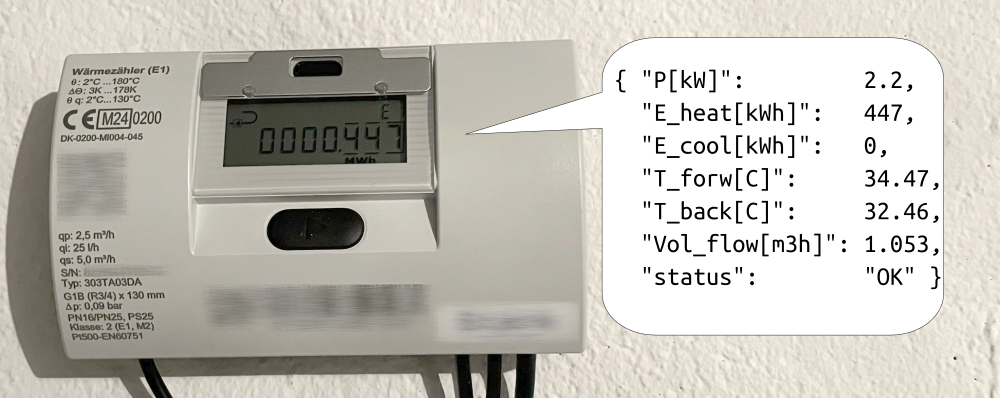
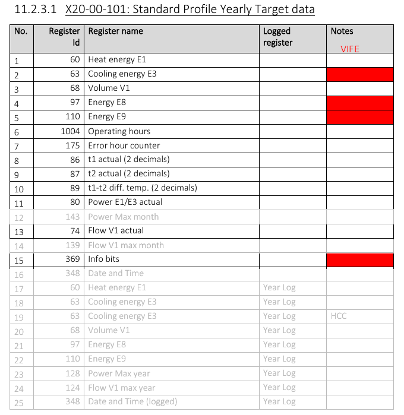
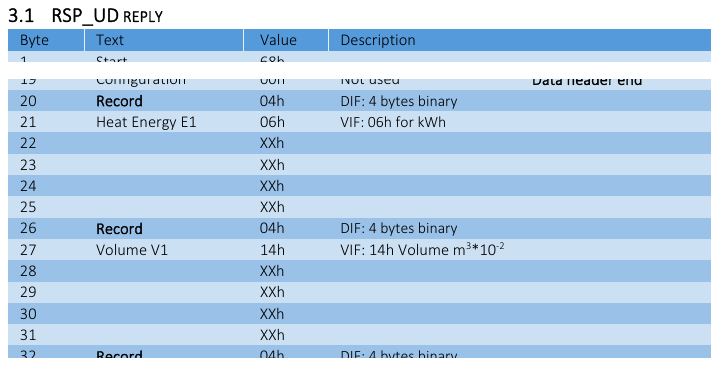
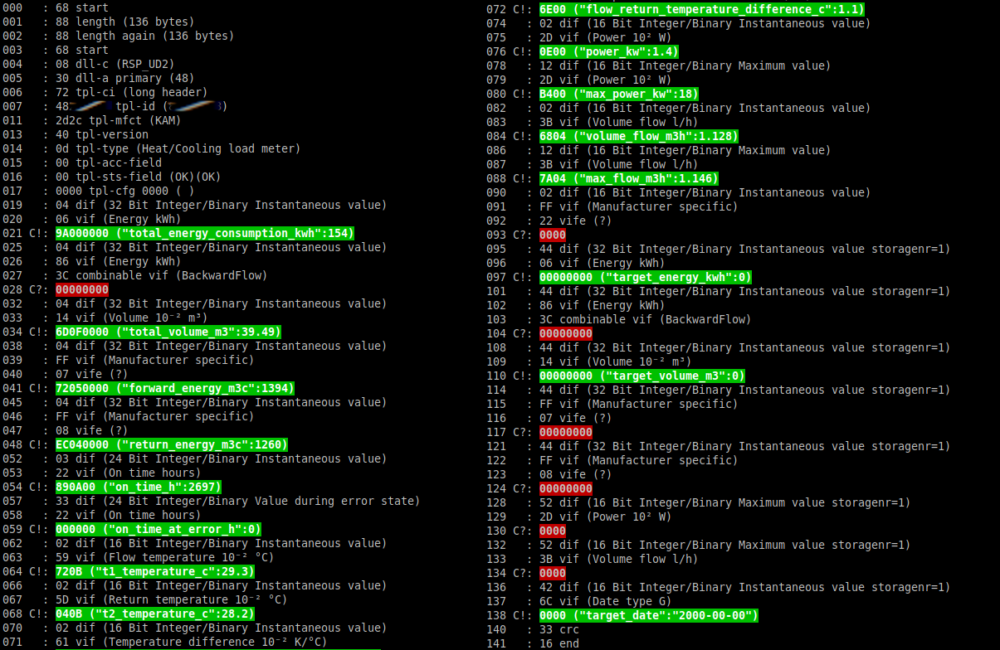

# Multical303_MBus2MQTT
Kamstrup Multical 303 heat+cooling meter data decoding for MQTT

## Goal



English below.

Das Ziel ist es, regelmäßig die Daten des Wärmemengenzählers Kamstrup Multical 303 [1] per M-Bus auszulesen, in verständliches JSON zu konvertieren und das per MQTT zu verbreiten. Da Bastelei nicht an Ländergrenzen halt macht, ist die Doku auf Englisch.

The goal is to regularly poll the heat energy meter Kamstrup Multical 303 [1] on M-Bus, convert the data to post-processing-friendly JSON and publish it via MQTT.

Not more, not less. It is **not** the goal to provide the ultimate general metering bus solution for everything. I just documented my way to reach the goal above, in the hope it saves you some research time when trying the same.


## Application Background

Why did I choose the Kamstrup Multical 303 [1]? I am not affiliated with Kamstrup, I am an ordinary end customer.  I wanted a bidirectional heat meter for a heat pump I am planning to install at my house.

In contrast to a standard heat meter, a "bifunctional heat/cooling meter" / "combined heat AND cooling meter" / "Klimazähler" is configured to also count the defrost energy that is taken from (not supplied to) the building. Note that the Multical 303 is offered in many different variants, not all of them support this (at least this is what the ordering number scheme suggests; I did not check if a user-re-configuration is possible).

Before installing the heat pump I want to use the same meter to collect data, which might then be helpful to choose the right heat pump. This is why the meter needed to provide a digital interface, and wired M-Bus seems to be a common choice. Also here, not all 303 offer this. 

Make sure to choose the right heat meter for your application. To be exact, mine is of type 303**T**A0**3**DA (printed on it; was not directly mentioned by my shop; see manual for explanation). I chose "qp 2,5" in size, for minimum pressure drop and working range from 25l/h to 5000l/h (I expect to see ~1700l/h). 

Why MQTT? For easy data distribution to the [local] network, without prior knowledge on further processing (e.g. saving to a database, which is not part of *this*  project).

## Hardware

Wired M-Bus seems to be pretty simple and can be processed by a microcontroller with little extra hardware, I know. But as I am building the system only once, I did not focus on the cheapest, most energy-efficient, or somewhat smartest solution. I chose to work with the following converter chain.


This way all intelligence will be in software, arbitrarily far away and well abstracted. 

Hardware costs were around 400 € (roughly 200 for the meter, 100 for hydraulic integration, 100 for electric integration, server not counted). 

## M-Bus Protocol 

A technical description of the meter is available online [2].

A technical description of the meter's M-Bus implementation is available on request [3].

A general M-Bus description is available online [4]. It may be outdated, but seems to be *the* reference for FOSS projects, as the current standard EN13757 is behind a paywall.

You most likely don't need those for plain usage; but they are helpful for development. And for the curious (like me for this project).

## Software

Here comes the interesting part. I found several similar projects, but which one will fit my needs? First things first...

### Ping | Low level check

I assume my server runs some Linux, though it will be a different one for development and deployment.

I found that some projects assume a [local] serial connection (like /dev/tty0 or /dev/ttyusb0), so the first task is to simulate one. [Stackoverflow users](https://stackoverflow.com/questions/22624653/create-a-virtual-serial-port-connection-over-tcp/22689163#22689163) propose socat. 

Next, let's send some ping. In M-Bus terminology, let's send a `SND_NKE` telegram. It does "not cause any actions in the meter, but the meter will reply with an `ACK` to indicate that the command has been received" [3].

The data to be sent is ([telegram format](https://m-bus.com/documentation-wired/05-data-link-layer#52-telegram-format)):

| Hex |  Meaning |
| -- | -- |
| 0x10 |  Start |
| 0x40 | **C**ontrol: SND_NKE, Initialization of Slave |
| 0xFE | **A**ddress: with address 254 all slaves reply|
| 0x3E  | Checksum: the arithmetical sum of the last two |
| 0x16 | Stop |

The expected response is:

| Hex |  Meaning |
| -- | -- |
| 0xE5 |  Single Character, ACK |

The Serial-Converter is configured for 2400 baud, 8 bits, even parity, 1 stop bit.

```
socat  pty,link=/dev/virtualcom0,raw,echo=0,mode=660  tcp:192.168.2.51:8234&
echo -n -e "\x10\x40\xFE\x3E\x16" > /dev/virtualcom0 
dd count=1 bs=1 if=/dev/virtualcom0 status=none | xxd -ps
```

outputs
```
e5
```
First success.

### The meter's address

Although for now there is only 1 device on the bus, you don't want to use the broadcast address permanently. 

The [standard](https://m-bus.com/documentation-wired/05-data-link-layer#52-telegram-format) sais "Unconfigured slaves are given the address 0 at manufacture", but Kamstrup indicates a serial-number-dependent default address [2]. Anyhow, there is a command for "overwriting" the address [3], just in case. 

To determine the address, we (could query the display or) send a "status request" `REQ_SKE` [49h](https://documentation.kamstrup.com/docs/M-Bus_MCIII_compatible_for_MC61_62_601_602_801/de-DE/Data_sheet/CONTEA955C9259B54883B0876E44FB24BC7E/) to the broadcast address `0xFE` and the meter "Replies with RSP_SKE" [3], which means we should receive a 5 byte answer including the address in the A-field.

```
REQ_SKE: 10 49 FE 49 16
RSP_SKE: 10 0B ?? ?? 16
               ^^
```

In my case I received ```10 0b 30 3b 16```, so my meter has address 30h. Display sais 48 (decimal). Fits. 


### The meter's data to be decoded

How standardized is the M-Bus at higher stack levels? Can we decode the byte array without device-specific knowledge?

The (only) command for requesting information is well-known: ```REQ_UD2```. The reply, ```RSP_UD```, is well-known, too. According to [3] and [4]...
   * ... it is 134 bytes long (at default profile),
      * which is less than 255 so we do not need to consider "Multi-telegram answers"
   * ... it is of telegram type "Long Frame" with "CI Field=72h", which stands for "Variable Data Structure (LSB First)", which consists of 
      * a [fixed-size-header](https://m-bus.com/documentation-wired/06-application-layer#631-fixed-data-header) (see below), and
      * a  list of values (see below),
   * ... it does not contain a "Manufacturer Specific Data Block"
      * so also the simplest way in this regard
   * ... it is self-describing (at least mostly, see below)

So the datagrams should be pretty easy to decode.

The fixed-size-header includes 
   * a 3-letter manufacturer code (here: KAM)
   * a manufacturer-dependent version/type (e.g. 40h="Multical 303")
   * a code for ["Medium"](https://m-bus.com/documentation-wired/08-appendix#841-measured-medium-variable-structure) (e.g. 0Dh="Heat/Cooling")

The values are encoded each as proposed by the standard, as "Variable Data Blocks". Each item includes
   * 1 byte DIF, data information field, e.g. "4 bytes binary"
   * 1 byte VIF, value information field, e.g. "Energy	in 10³ Wh [=kWh]"
      * or a special case, of which Kamstrup uses VIF=FFh ("manufacturer specific") with 1 byte VIFE added in here.
   * x (e.g. 4) bytes of actual data

Up to now it seems everything is well defined by the standard. There is a good abstraction level for heat meters, with manufacturer-independent encoding. E.g. there are different codes for 2 temperatures, to distinguish between "flow pipe" and "return pipe". But obviously the standard lacks something...

There is only 1 code for Energy, and it makes sense to use that for heat. But although the standard allows to *define* a heat-*and*-cooling meter, it does not distinguish between mulitple kinds of energy. There is no code for cooling energy.

Kamstrup solved this issue by using manufacturer specific values (VIFE). At least this is what I thought after reading the manual [3].

So we can conclude: For a first decoding attempt, knowledge of the standard (and thus every software that implements it) should suffice. But for real world usage we need to add the knowledge of "manufacturer specific" encoded values from [3] chapter 4. For my goal at least Kamstrup's VIFE 02h = "Cooling Energy (E3)".

So I expect that there is some software that is able to do pretty much of the decoding out of the box, but still will need some configuration for my use case. I indicated values that I expect to be VIFE coded here in table 11.2.3.1 of [2]:



As I am planning continous readouts I don't care about the internal logging capabilites and ignore the "Max" and "Logged registers" as well as the internal clock (date and time).

What makes we wonder is that the datagram described in [3] misses some rows meantioned above:


Where is "Cooling energy E3" hiding? Probably the example lacks it because it is given for a heat-only meter, which shares the same document. I am curios what the real answer will look like...

REQ_UD2 ```105B308B16``` results in the following RSP_UD REPLY:
```6888886808307248xxxxxx2d2c400d0000000004069a00000004863c0000000004146d0f000004ff077205000004ff08ec0400000322890a0033220000000259720b025d040b02616e00022d0e00122db400023b6804123b7a0402ff22000044060000000044863c0000000044140000000044ff070000000044ff0800000000522d0000523b0000426c00003316``` (142 bytes). 


### Projects considered

After some research in 2024 I found the following projects sound potentially useful. Sorted roughly by age of first commit. As I did not have hardware available at the time of research, the following thoughts are rather theoretical.

<!--- 2012 EmonCMS 2022 emonPi2-->
 * [openenergymonitor.org](https://openenergymonitor.org/) 
   * [github EmonCMS](https://github.com/emoncms/emoncms) <BR/>
   "Emoncms receives data from OpenEnergyMonitor monitoring hardware" "for processing, logging and visualising energy [...] data."
   * [Forum: Kamstrup 303](https://community.openenergymonitor.org/t/compatible-kamstrup-heat-and-carlo-gavazzi-electricity-meters/25459) <BR/>no success reported. unknown if supported.
   * [Docs: emonHub > Interfacers > M-Bus Reader](https://docs.openenergymonitor.org/emonhub/emonhub-interfacers.html#m-bus-reader-for-electric-and-heat-meters) 
      * "[EmonHub](https://github.com/openenergymonitor/emonhub) is a piece of software running on the emonPi and emonBase that can read/subscribe or send/publish data to and from a multitude of services. It is primarily used as the bridge between the OpenEnergyMonitor monitoring hardware and the Emoncms software"
      * includes example configuration for Kamstrup Multical **4**03
      * proposes [M-Bus to USB Converter](https://shop.openenergymonitor.com/m-bus-to-usb-converter-heatpump-monitoring/) on Raspberry-Pi-like hardware; uses ```/dev/tty*``` as hardware interface
      * can "Publish to MQTT". 
   * Sounds as if the subproject emonHub is pretty much what I am looking for. But what makes me hesitate: 
      * My meter does not seem to be supported out of the box; may need some adaptions / digging deeper.
      * smells like overkill. 

<!---2012-->
   *  [github rscada/libmbus](https://github.com/rscada/libmbus)
      * looks like a good old pleasant C lib 
      * supports serial as well as TCP connection as input
      * can output XML; adaption or postprocessing necessary to gain JSON
      * as far as I understand, there is no real concept for handling VIF=0xFFh "Manufacturer specific". 
<!---      * people write [translators](https://community.home-assistant.io/t/my-approach-to-m-bus-and-home-assistant/668901) -->

<!---2017--> 
   * [github wmbusmeters/wmbusmeters](https://github.com/wmbusmeters/wmbusmeters) 
      * [Issue: Add support for Kamstrup Multical 303](https://github.com/wmbusmeters/wmbusmeters/issues/584) "Closing issue as driver were implemented." <BR/>
        Supports MC303. <BR/>
        "cooling energy E3" seems to be missing in [example data](https://github.com/wmbusmeters/wmbusmeters/blob/master/src/driver_kamheat.cc) <BR/>
        I think it could easily be integrated, similar to "E8"
      * supports serial input (among others), supports JSON output (among others)
      * generic architecture; manufacturer-dependent knowledge is added as so-called "drivers"
      * Compared to libmbus: Much more stars on github (911 compared to 224 at the time of writing), <BR/> but also much more complex (56K lines of code compared to 9K, according to cloc)

<!---2019-->
   *  [github AllWize/mbus-payload](https://github.com/AllWize/mbus-payload)
      * little bloat potential; only 1K lines of cpp code; though it even provides *en*code capabiltiy which I don't even need.
      * seems to be made for Arduino -> promises low ressource usage
      * seems it does *not* support manufacturer specific (VIF*E*) values which I need for "cooling energy E3"; <BR/>
        though I think it could easily be hacked in (at least for my use case);
        all magic happens in function ```MBUSPayload::decode()``` (<<100 lines).

 <!---2022
   *  [github corny/mbus-esp32](https://github.com/corny/mbus-esp32)
      * does *not* do any decoding. 
lass das weg. sonst muesste ich auch sowas listen https://github.com/matthijsvisser/kamstrup-402-mqtt -->

 <!---2023--> 
   * [github hansij66/kamstrup2mqtt](https://github.com/hansij66/kamstrup2mqtt)
      * "Tested with Kamstrup Multical 303"
      * ~1K loc python + dependencies, mostly [meterbus](https://github.com/ganehag/pyMeterBus)
      * meterbus: "Known issues: Missing: Extended VIF codes". [This comment (line 170)](https://github.com/hansij66/kamstrup2mqtt/blob/main/kamstrup_mbus.py) seems to prove, as output for e.g. E8 is quite unspecific and not really decoded. E3 is missing. 

 <!---2023-->
   *  [github Zeppelin500/MBusinoLib](https://github.com/Zeppelin500/MBusinoLib) <BR/>
      * "based at the AllWize/mbus-payload library but with much more decode capabilities. mbus-payload's encode capabilities are not supported."
      * MBusinoLib is the pure decoding library (~1K loc); a full solution from hardware to MQTT is available at [MBusino](https://github.com/Zeppelin500/MBusino)
      * as far as I understand, noticable "manufacturer specific"-support is *not* included in the announced "much more decode capabilites". 

A hard choice. It seems that none of these projects can read all values of a Kamstrup Multical 303 in the heat-*and-cooling* variant out of the box.

Side note: if bidirectional meters and their software support is so uncommon, there may be a few people doing wrong calculations on their heat pump efficiency, despite using a calibrated heat meter. Of course it depends on the exakt system and usage whether this is a real issue or just a theoretical  glitch. 

I am a big fan of simple solutions and I think wmbusmeters does not fit well in this category, as it is one of the largest projects of the above. But it is a great project, as it seems to be the only one whose concept allows an easy and clean way for adaptions to my hardware and use case. So i will give it a try.


### wmbusmeters

Feeding it with the data from above
```
./wmbusmeters --analyze  6888886808307248xxxxxx2d2c400d0000000004069a00000004863c0000000004146d0f000004ff077205000004ff08ec0400000322890a0033220000000259720b025d040b02616e00022d0e00122db400023b6804123b7a0402ff22000044060000000044863c0000000044140000000044ff070000000044ff0800000000522d0000523b0000426c00003316
```
produces


As expected, a few values could not be decoded. I am particularly interested in the one at bytes 25-31, which is supposed to be cooling energy:

```
025   : 04 dif (32 Bit Integer/Binary Instantaneous value)
026   : 86 vif (Energy kWh)
027   : 3C combinable vif (BackwardFlow)
028 C?: 00000000
```

But the encoding is different from what I expected. Chapter "Kamstrup specific VIF Extensions" of [3] defines e.g.:

So I expected to see something like
```
026   : FF vif (Manufacturer Specific)
027   : 02 vife (Cooling Energy (E3))
```
but this ist not the case. This is suprising, because Kamstrup uses this exact method for ```forward_energy_m3c``` etc..

But wait, wmbusmeter was able to decode "Energy kWh" and "BackwardFlow", without knowing my expectation. Is there a manufacturer-agnostic way of encoding, that I have not seen before?

VIF 86h is to be read like 06h ("Energy in kWh") + 80h ("Extension bit set") ["for an enhancement of VIF"](https://m-bus.com/documentation-wired/08-appendix#845-codes-for-value-information-field-extension-vife). So the following byte 3Ch refers to "Energy in kWh". 3Ch is [defined as ](https://m-bus.com/documentation-wired/08-appendix#845-codes-for-value-information-field-extension-vife) "E011 1100	Accumulation of abs value only if negative contributions". In fact, this is exactely what it is supposed to say: Counting "negative" energy. Cooling instead of heating.

By the way, there is also a code for "Accumulation only if positive contributions". I don't know why Kamstrup did not apply this "enhanced" information to heat energy. Probably to avoid compatibility issues.
And I wonder why Kamstrup defines a manufacturer specific way, if there *is* a standard-compliant manufacturer-agnostic way. And I am impressed of the M-Bus-authors' work. Covering so many use cases in a both comprehensible and efficient manner. 

Summary: I recommand [wmbusmeters](https://github.com/wmbusmeters/wmbusmeters) for the main software part (see [pull request](https://github.com/wmbusmeters/wmbusmeters/pull/1396) if you need the proposed adaption). The python script here is more or less just a wrapper around it.


## Links

[1] [kamstrup.com > MULTICAL® 303](https://www.kamstrup.com/de-de/waermezaehlerloesungen/waermezaehler/meters/multical-303) <BR/>
[2] [kamstrup.com > MULTICAL® 303 > Documents > Technical description](https://www.kamstrup.com/de-de/waermezaehlerloesungen/waermezaehler/meters/multical-303/documents) <BR/>
[3] Document 5512-2760 "M-Bus technical description MC303"; 55122760_A1_GB.pdf; requested from service@kamstrup.com  <BR/>
[4] https://m-bus.com/documentation <BR/>


